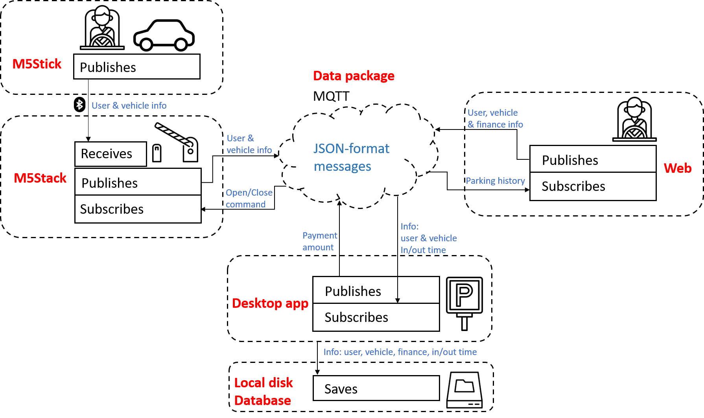
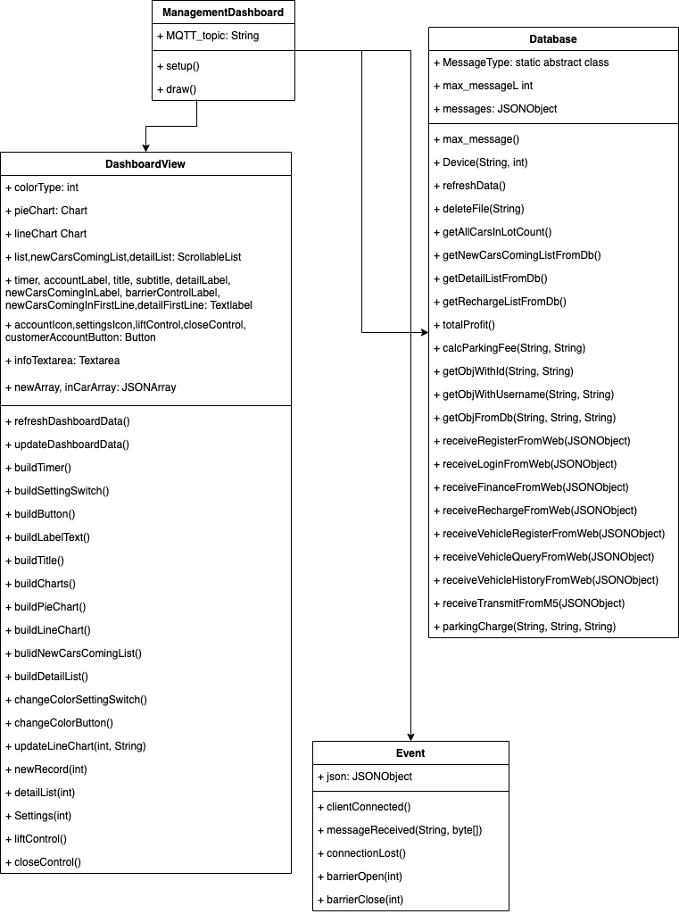
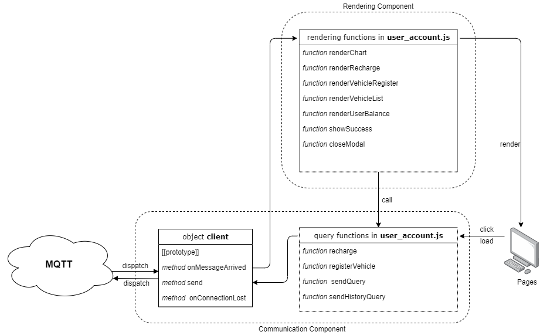
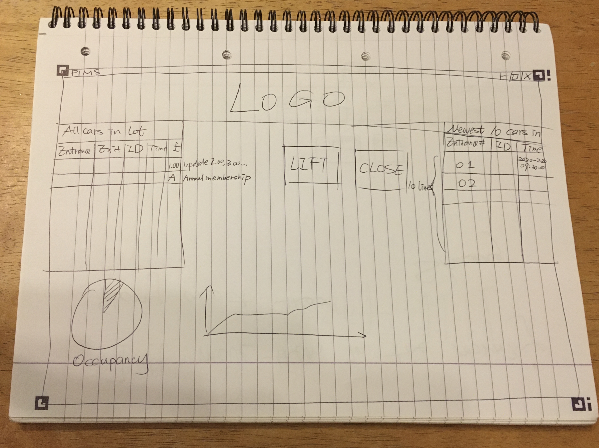
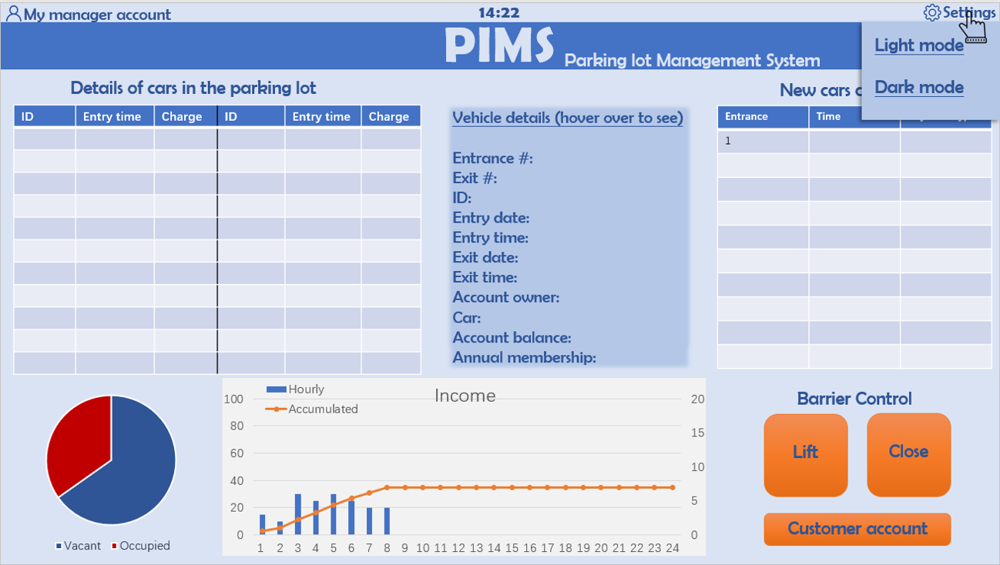
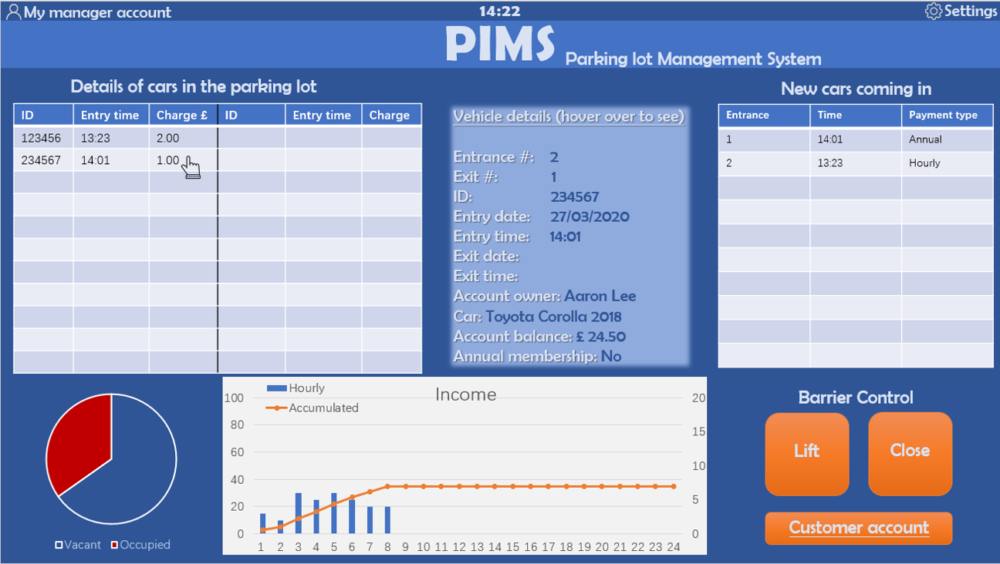
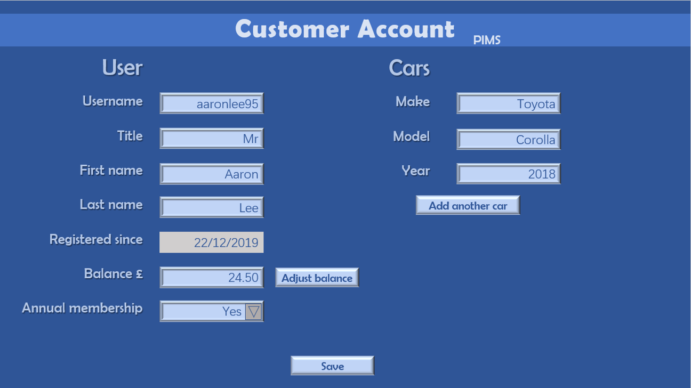
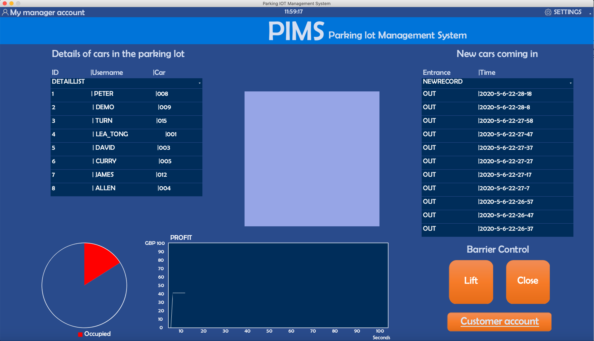

# System Design

## Contents
* [Architecture of the entire system](#_a)
    * [Schemetic diagram](#_diagram)
    * [Individual roles](#_roles)
* [Requirements of key sub-systems](#_b)
* [Object-Oriented design of key sub-systems](#_c)
* [The evolution of UI wireframes for key sub-systems](#_d)
* [Details of the communication protocols in use](#_e)
* [Details of the data persistence mechanisms in use](_#f)
* [Details of web technologies in use](#_g)

<a name="_a"></a>
## Architecture of the entire system
<a name="_diagram"></a>
### Schemetic diagram


There are 6 elements in this design:
* 1 broker - HiveMQ MQTT
* 3 online elements
    * Web application
    * Desktop application
    * Hardware - M5Stack
* 2 offline elements
    * Hardware - M5Stick
    * Local database

<a name="_roles"></a>
### Individual roles
#### MQTT
HiveMQ MQTT is the mandatory broker given by the lecturers to connect the online elements, which are publishers
and/or subscribers. The messages published on MQTT can also be seen by going on
to its website.

#### Online elements
* Web\
The website is developed by Bootstrap and is designed for customers to access
their personal account. Once the customer
wishes to use this service, they should open an account with us and register their
vehicles on the website. The website also provides records of their usage histories.


* Desktop application\
The desktop application is developed by Processing. It is designed for managers
at the parking lots to monitor and manage the parking lot. It visualises the
occupany of the parking lot and monitors the vehicles using this parking lot.

* M5Stack\
The M5Stack is a small IoT (Internet of things) device compatible with Arduino and
has built-in sensors (e.g. accelerometer, gyroscope), WIFI, bluetooth,
colorful screen and buttons. In our design, it acts as the parking lot
entrance/exit barrier. It is mounted at the parking lot entrance/exit.
The screen will display the barrier's status (open or close).

#### Offline elements
* M5Stick\
M5Stick comes with M5Stack and is even smaller than M5Stack. It also has a screen,
a button and bluetooth. In our design, the M5Stick acts as a key to open the
parking lot barrier (M5Stack). This means that the M5Stick is kept by the driver
in the car. During the driver's registration process, he/she must link the M5Stick's
bluetooth address with his/her PIMS account. When the driver wishes to enter/exit
the parking lot, he/she only needs to press the button on M5Stick
when the M5Stick and M5Stack (barrier) are in the vicinity.

* Local database\
There is a simple data storage system in this design since it is not the
focus of the project. The data of the customers' from out website are passed
through MQTT and saved on the local hard disk in the manager's desktop. Each
parking lot should have at one manager that keeps the application open all
the time, so the customers' data can be saved on the hard disk.  

<a name="_b"></a>
## Requirements of key sub-systems
### M5Stack (Barriers)
An M5Stack and an Arduino MKR WiFi 1010 make up a barrier at a car park.
Each barrier has a unique id and a type (either 'in' or 'out'). Barriers of
type 'in' are those which are located at the entrances of car parks, while
'out' typed barriers are situated at the exits of parking lots.
Each barrier scans the Bluetooth (BT) devices in its vicinity every and reports their BT addresses, and their Received Signal Strength
Indicators (RSSIs) to our server. Meanwhile, the barrier continuously listens
to commands sent from our server and hardware interrupts (button presses)
triggered on the barrier itself to execute corresponding operations such as
lifting and descending.

A barrier must meet the following requirements:
1. Has a unique id.
2. Able to connect to the Internet via a WiFi access point.
3. Able to retrieve the BT address and the RSSI for every BT device that is
 detectable.
4. Able to perform (2) regularly (every 5 seconds) and package the information
 into a JSON object for a session of scanning.
5. Able to send the JSON object created in (3) to our server right after its
 creation.
6. Allowing remote control by receiving and executing commands sent from our
 server.
7. Allowing manual control by responding to hardware interrupts.

### M5Stick (Keys)
Each M5Stick-C is a key that is recognizable by any barrier in our system.
These keys are used to identify registered users.
Since our barriers seek BT devices, the keys are in essence BT advertising devices.

Following requirements must be satisfied for the keys:
1. Has a unique id.
2. Powered by rechargeable batteries so users can use them outside freely.
3. Can advertise itself as a BT device
4. The BT advertising state can be switched on and off for using and saving
energy, respectively.

### Web application
Users use the web application to sign up/log in an account, register their information, and see their account status. In order to enable users to use the web application to manage their accounts smoothly, it must fullfil the following requirements:
#### Sign up and log in
1. Allow users to sign up a new account -> inform the desktop app that there is a new user registration.
2. Allow users to log in to have access to their own accounts -> validate username and password with desktop app and keep the logged status with cookies.
3. Prevent the illegal access to user account page -> filter access by validating cookies.
#### User Information Registration
1. Users can register a new vehicle with a key delivered to them -> inform the desktop app and re-render the vehicle list.
2. Users can top up their balance -> inform the desktop app a recharge made by users and send re-render the balance value.
#### Display user info and statistical data
1. Show the user's username, the vehicle they own, their account balance, and the vehicle they -> fetch user account info from the desktop app and render it on the account page.
2. Display the statistical data of parking time in the last 7 days, showing in chart -> fetch a list of parking time and render the chart.

### Desktop application

Since this project is a parking management software prototype, we designed
the requirements of the desktop client system with full consideration of
different client usage situations. Due to the limitation of this project,
we can only store the customer's data on local hard disk on the manager's desktop.
This makes the desktop app a bridge between the web app (customer end) and
the hardware side (the barriers).

To elaborate, customers' registration data from the website must be sent through the
broker to desktop app for storage and customers' enter request must also
be sent by the barrier (M5Stack) through the broker to the desktop app for
verification.

The above communication happens automatically at the back end, whereas the front
end is only for data visualisation so parking lot managers can closely monitor
the parking lot.

#### Back end requirement

As mentioned above, the desktop back end acts as a bridge between web app
and the barriers, so the following points are required in the design.

1. Subscribe and retrieve users' and their vehicles' registration information
 from MQTT (published by web app).
2. Parse the messages from MQTT, separate them into specific topics (e.g.
user registration, vehicle registration, user account top up etc) and store
them on the local hard drive as JSON files.
3. Pack up the locally stored data and publish onto MQTT per web app's request.
4. Subscribe and retrieve users' enter/exit request at the parking lot
   from MQTT (published by M5Stack).
5. Parse the messages from MQTT, separate them into specific topics, namely the
    entrance request and exit request, and store
    them on the local hard drive as JSON files. Note that when the car enters
    the parking lot, the type "in" JSON file is generated, but it will be replaced
    by type "out" JSON file once the car leaves, for the "out" JSON file
   covers more abundant information (the time on exit).
6. Send receipt to web app or M5Stack via MQTT after receiving their messages.
7. After receiving the entrance request, the desktop app determines whether
the bluetooth address with the highest signal strength corresponds to the
registered car. If not, it continues to search for a bluetooth address with a
slightly weaker signal strength until it find the registered car. According
 to the parking information of the car in the database to determine the
 current parking status of the car, so as to determine whether the barrier can
 be opened this time according to the comprehensive situation of the bar and
    the car. If the car is already in the garage, even if the car's entrance
signal is received, it will not repeatedly open the entry rod.
8. The entrance and exit requests and the user's essemtial information are
logically processed and used to modify and save the new user's information
required to achieve a dynamic refresh. In this project, we need to use access
 times and user account balances for calculations so that the parking lot can
    be profitable. And this underlying methodological logic should be
    implemented along with the data stored.
9. Send control commands to the barrier. Into the desktop app display
requirements above says that when using the remote barrier switch function,
the post-desktop API should provide the interface to send data request
packets for the switching barrier to the barrier via MQTT. When the car enters
 or exits the parking lot, the desktop must send a message to the M5Stack to
 control the barrier's behaviour. After the barrier opens, a 5-second pause
 is required to give the car a time to pass the barrier, and a
    message to close the barrier is sent after 5 seconds.
10. To provide all the data to be fetched and thus make a software back-end API.
 It is also the underlying arithmetic that the software should implement at
    the desktop app runtime. Various interfaces are provided for other functions.

#### Front end requirement
In the regular usage of the desktop app, the parking lot manager sits in the central
control room of the parking lot and uses a desktop computer for the desktop app.
So at the operational and display level, the desktop app should meet
 at least a few requirements.

1. Real-time display of information on different vehicles passing through
various barriers, with dynamic refreshing. This will be an essential feature
 of this software. As a management need, managers have the right and duty to
    know exactly who is driving what car and at what time to enter or leave that
   parking lot. This record should be kept locally for managers to view in
    real-time.
2. Real-time display of the vehicles remain in the parking lot, along with
 necessary information about those vehicles. This is the second function
 derived from the first one above. As a management system, it is, of course,
    essential to have a thorough understanding of the details of the vehicles
    to be checked in the management area. For example, check the entry time of
   a vehicle in the parking lot, and if the parking time is too long and the
   account balance is insufficient, then managers should be prepared to handle
    the vehicle when it is ready to leave the lot.
3. Real-time display of used spaces in the parking lot as a percentage of all
spaces in the form of a pie chart. This feature is designed on the fact that
 when the parking lot is busy during rush
 hour, there will be long lines of entering vehicles waiting to enter the lot.
 If the managers are alerted before the parking lot is about to be filled, there
    will be plenty of time to clear the entrance without a large number of
    vehicles clogging the parking lanes and causing potential traffic hazards.
4. Real-time display of parking revenue. This feature is essential to
 the management system because parking lots operate based on
    customary charges for parking, so it is necessary for managers to understand
   how much they earn. This can be then checked against the revenue in the PIMS
   company bank account.
5. The ability to manipulate the barrier. There are likely technical issues of broker
communication, verification process, or special occasions that the manager
has to lift up or lower the barrier themselves.


<a name="_c"></a>
## Object-Oriented design of key sub-systems
### Desktop app


The basic object-oriented model for this project is shown in the figure. The DashboardView part of the picture is the view part of the MVC model. This section is dominated by the build program view section, so it is mainly for the construction of the program's graphical interface, with  UI build()  functions dominating. The Database section shows the Model section. The GETS and RECEIVES functions are the main ones. where MessageType is the important message storage abstract class that defines all data types. Event is the main controller part. Mainly for the interaction of the desktop app with the barrier and the interaction of the desktop app with the web client. MQTT is also mainly applied in this part as a means of communication.

The overall architecture of the desktop side is designed in such a way that multiple people can work together on the same project using object-oriented design. The back-end engineer first builds the underlying model and data structure part as the overall framework, and the rest of the system can build the remaining components based on the framework. Because the back-end engineers need to dock both the web and M5Stack data processing needs, the two back-end engineers are working on the model and controller, respectively. As the data structure becomes more complex, the model part will be satisfied with more than simple GETS() and SET() methods, more logical calculations will be performed inside the model. And controllers are more concerned with receiving and sending data streams at MQTT, thus separating the model from the controller. So we have a relatively independent build view file in the architecture to handle the build() method of building images.

### Web application


The diagram above shows the working flow of the web application and demonstrates the core object for communication and the categorization of functions in [user_account.js](../../web_application/user_account.js). We mainly used functions in the scripts to implement the core functionality of the user logics, and render the pages dynamically. 

* How this works?

  There are two functional components that the web application have -- communication and rendering. In general, the rendering component is directed by the communication component, in another word, the web pages are re-rendered when a valid message is received. However, the rendering component can also trigger the communication component, because for some types of messages, only when the former messages arrive can another query be made. For example, when and only when a message of which type is `web_vehicle_query` arrives, the client will be able to send a query of `web_history_query` to fetch parking history of the first vehicle in the fetched list.

  * The communication component contains an object client, which is for the direct communication with MQTT, and several functions that compose message bodies and send the messages by calling `client.send()`.
  * The rendering component contains a bunch of functions that manipulate the DOM tree, render the elements, and trigger another communication process.

  The work flow is: 

  1. At the stage of pages loading or user clicking the buttons on the web pages, query functions in the communication component will be called.
  2. The query function composes a message body and calls the `client.send`.
  3. The client object publishes the message to broker via MQTT.
  4. The Desktop application receives the message and gives a response message.
  5. The client receives the message and calls a function in the rendering component
  6. The rendering function re-render the elements in the DOM tree and displays new data on the web page. For some of the rendering functions, a function in the communication component will be called to trigger a new cycle.

* Tips for programmers who take over this project
  * In order to add a new feature, you must add two functions, one in the communication component and another one in the rendering component.
  * This schema could be refactored to be more object-oriented. For example, the communication component can be encapsulated into one object that contains all functions for communication and connection, and the rendering component is also potential to be refactored to be an object of JavaScript.

<a name="_d"></a>

## The evolution of UI wireframes for key sub-systems
### Desktop front end
#### Version 1.0 - Hand drawing in MVB lab
The initial design of the desktop app was drawn as below.



#### Version 2.0 - PowerPoint sketch
Before building on Processing, we used PowerPoint to draw out the electronic
design to have an idea of the screen size and colour scheme, so that when coding in
 Processing we will have something to follow. In the PowerPoint,
we have designed two colour mode - light and dark:




More than that, we also designed another page in the desktop app corresponding
to the bottom right button "Customer account":



#### Version 3.0 - Processing
In the end, we amended the design to the below. The differences are:
1. Top left chart is changed from two-column to one-column, because two-column
can be confusing at times and if we use a scrollable chart we will be able to show
just as much information as having a two-column chart.
2. Bottom middle chart is changed from a combined chart (bar and line) to just
a line chart, because in the testing period, we only have 1 MStick (key) thus
1 car to enter/exit. This means the revenue will not change as frequently as in
reality. The bars that were supposed to indicate the revenue made per hour will
be 0 at most times;
3. In the line chart, we changed the x-axis unit to second from hour. This is because
when we test it, we cannot afford to continue the activity for days to see the line chart
re-rendering every hour. Thus, in order to see the result instantly, the x-axis
represents second and the chart re-renders every second.
4. We completely eliminated the "Customer account" page in the end because it is not
necessary and can be moved to "future work" section.



### Desktop back end - JSON file format
The format of the json file has changed many times throughout the design process.
According to the different requirements of the system and the different design of
the system, the format of json should also be constantly designed.
#### "barrier_type"
In the "data_type": "m5_transmit" json file, according to the initial assumption,
we only have "barrier_id" in "barrier_info" to identify the barrier. The previous
idea was to have the entrance and exit sharing the only barrier (the only M5Stack).

```
{
    "data_type": "m5_transmit",
    "barrier_info":{
        "barrier_id": 12345,
    },
    "bluetooth_devices":
        [{
            "bluetooth_address": "47:a9:af:d2:63:cd",
            "RSSI": -80
        }]
}
```

However, we found that in that case, since the M5Stack scans for bluetooth
addresses every 5 seconds and transmits the closest one to the broker,
if the car parks close to the barrier, 
the M5Stack will detect its bluetooth address over and over again
 and keeps opening and closing,
indicating the car keeps going in and going out, repeatedly, despite the car
(M5Stcik) is staying still.
This may be less of a problem in reality but during our tests, we only had
one registered bluetooth address, which was the M5Stick, so it would always be
detected. 

To solve this, we added **"barrier_type"** attribute to separate the barrier
at the entrance and the exit. If the car
is outside the parking lot, only the entrance barrier will open. If the car is in the
parking lot, only the exit barrier will open.

```
{
    "data_type": "m5_transmit",
    "barrier_info":{
        "barrier_id": 12345,
        "barrier_type": "in"
    },
    "bluetooth_devices":
        [{
            "bluetooth_address": "47:a9:af:d2:63:cd",
            "RSSI": -80
        }]
}
```

#### "status"
In the "data_type": "web_register" json file, we didn't have the **"status"** field to
 begin with. Instead, we only had a boolean attribute "is_success"
  to determine whether the registration is successful.

```
{
	"data_type": "web_register",  
	"info": {
			"username": "lea_tong",
			"password": "password",
			"is_success":"true"
		}
}
```
However, we found that other than the 3 online elements subscribing to MQTT,
the MQTT also subscribes itself. This means only a boolean is not enough.
Thus, we intriduced the **"status"** field to distinguish
 from whom this message was published. It is an integer field which can deal
 with multiple situations, including whether a request is successful
 or where the message comes from.
 ```
{
	"data_type": "web_register",  
	"info": {
			"username": "lea_tong",
			"password": "password",
			"status": 2
		}
}
 ```


<a name="_e"></a>
## Details of the communication protocols in use
### Rules for communication
   - All message must go through MQTT.
   - The 3 online application must subscribe the same topic "PIMS" on MQTT.
   - Each session connected must be a "round-trip". In other words, when
      sender sends a message via MQTT to receiver, it also expects to receive
      a receipt (in the form of a MQTT message, too) from the receiver whether the
      request is valid.
   - MQTT messages (in the form of JSON objects) must contain a "status" flag
      that indicates its origin and validation status. I.e. "status=2" means the
      message is from web end to desktop end (acting as a server).
      Then in the receipt, "status=1" means the request is successfully verified
      by the server, whereas "status=0" means the request has failed.

Since different parts of our system send information asynchronously, we
decided to let them publish different JSON objects to the MQTT topic 'PIMS'
but all with an attribute named 'data_type' to signal the receivers to pick
up the right messages. <br>

We could have packaged them into a single JSON array and designated an index
 of that array for each recipient. However, that would have introduced another
  level of complexity for the JSON objects and reduced their overall
  readability. After careful consideration, we abandoned this approach.

### Iot
#### "m5_transmit"
Sender: __Barriers__ <br>
Receiver: __the Desktop App__ (currently acts as a server)

```
{
    "data_type": "m5_transmit",
    "barrier_info":{
        "barrier_id": 12345,
        "barrier_type": "in"
    },
    "bluetooth_devices":
        [{
            "bluetooth_address": "47:a9:af:d2:63:cd",
            "RSSI": -80
        }]
}
```

This JSON object contains information about the BT devices that were present during the last scan period and the barrier that sent this message. <br>
The keys are self-explanatory by their names.<br>
One thing worth mentioning is that each cell in the "bluetooth_devices" array corresponds to a single BT device and the size of this array is dynamic (equals to the number of devices that were detectable by that barrier in the last scan).

#### "m5_receive"
Sender: __the Desktop App__ <br>
Receiver: __Barriers__

```
{
	"data_type": "m5_receive",
	"barrier_id": 12345,
	"op_code": "A"
}
```

This JSON object acts as a command from our server to a specific barrier. <br>
"barrier_id" indicates which barrier should react to this command. <br>
"op_code" dictates what operation to perform, as defined in [Barrier_orders.h](/M5Stack_bluetooth_detector/Barrier_orders.h).

### Web app

[Data type](../../data_structure.json) used in the communications between this web application and the controller contains `web_login`, `web_register`, `web_vehicle_register`, `web_vehicle_query`, `web_finance`, `web_recharge` and `web_vehicle_history`.

All of the data is sent in the format of JSON. The queries sent by web app have the status code `2`, while the response from the controller has the status code `1` or `0`, represent success or failure respectively.

If the query result is fail (e.g. the username the user intended to register already exists, password validation failed, the M5 stick key has already been reigistered, or some other things went wrong), the controller will send a failure message. The failure messages are in a unified format:

```
{
	"data_type": "example",
	"info": {
			"username": "lea_tong",
		    "status": 0
		}
}
```

The data_type field specifies the data type of the original query message that caused this failure while the username field shows the username that the original query message was made by, and the status field indicates that this is a failure message.

All messages received by the web application will be checked the ownership -- whether this message belongs to the current user.

#### "web_login"

**Query** (status = 2):

```json
{
	"data_type": "web_login",
	"info": {
			"username": "lea_tong",
			"password": "password",
		    "status": 2
		}
}
```

**Success** (status = 1)

```json
{
	"data_type": "web_login",
	"info": {
			"username": "lea_tong",
		    "status": 1
		}
}
```

**Failure** (status = 0)

```json
{
	"data_type": "web_login",
	"info": {
			"username": "lea_tong",
		    "status": 0
		}
}
```

Send a query message for validation of user login. Send query with status = 0 to broker and the desktop application will receive this message and return a response containing a status code showing whether the user login validation is successful. The field of username is used for logging cookies to keep the logged-in state.

#### "web_register"

**Query**

```json
{
	"data_type": "web_register",  
	"info": {
			"username": "lea_tong",
			"password": "password",
			"status": 2
		}
}
```

**Success**

```json
{
	"data_type": "web_register",  
	"info": {
			"username": "lea_tong",
			"status": 1
		}
}
```

Send this query to the broker to register a new account. The desktop application will return 1 if succeeded to register this new user while 0 if the user already exists. The username field in the response messages (success and failure) is used for web application checking whether this message is supposed to be received by the current user.

#### "web_vehicle_register"

**Query**

```json
{
	"data_type": "web_vehicle_register",
	"info": {
			"username":"lea_tong",
			"vehicle_id": "acdjcidjd",
			"vehicle_type":"car",
			"status": 2,
			"bluetooth_address" : "47:a9:af:d2:63:cd"
		}
}
```

**Success**

```
{

	"data_type": "web_vehicle_register",   
	"info": {
			"status": 1,
			"username":"lea_tong"
		}
}
```

Register a new vehicle for current user. The desktop application returns status 1 and username if this registration for vehicle succeeds, otherwise will return the failure message.

#### "web_vehicle_query"

**Query**

```
{
	"data_type": "web_vehicle_query",    
	"info": {
		"username": "lea_tong",
		"status": 2
	}
}
```

**Success**

```
{
	"data_type": "web_vehicle_query",
	"info": {
		"username": "lea_tong",
		"vehicle_list": [
			{
				"vehicle_id": "example01",
				"vehicle_type": "car"
			},
			{
				"vehicle_id": "example02",
				"vehicle_type": "lorry"
			}
		],
		"status": 1
	}
}
```

The web application sends this query to fetch a list of vehicles that are owned by the current user.

If there is no vehicle owned by the user, the controller will send the success message with an empty array in vehicle_list field.

Get failure status if there is something goes wrong in the back-end.

#### "web_vehicle_history"

**Query**

```
{
	"data_type": "web_vehicle_history",
	"info": {
		"username": "lea_tong",
		"status": 2
	}
}
```

**Success**

```
{
	"data_type": "web_vehicle_history",
	"info": {
		"username": "lea_tong",
		"vehicle_id": "A007",
		"0": 4.3,	  
		"1": 15,     
		"2": 10.9,
		"3": 11.4,
		"4": 18.7,
		"5": 0,
		"6": 7,
		"status": 1
	}
}
```

Send this query to fetch a list of statistical data of one specific vehicle's history parking time in the last 7 days.

#### "web_finance"

**Query**

```
{

	"data_type": "web_finance",
	"info": {
			"username":"lea_tong",
			"status": 2
		}
}
```

**Success**

```
{

	"data_type": "web_finance",
	"info": {
			"username":"lea_tong",
			"balance": 21331,
			"currency":"GBP",
			"status": 1
		}
}
```

To get the current user's balance in their account.

#### "web_recharge"

**Query**

```
{

	"data_type": "web_recharge",
	"info": {
			"username":"lea_tong",
			"card_number":"326173173718",
			"pay_amount":"10",
			"status": 2
		}
}
```

**Success**

```
{

	"data_type": "web_recharge",  
	"info": {
			"username":"lea_tong",
			"balance": 21331,
			"currency":"GBP",
			"status": 1
		}
}
```

Send the query to broker so that the controller can receive this message to recharge for the user. If success, the controller will send back to the user the message containing the user's current balance and the type of currency.


<a name="_f"></a>
## Details of the data persistence mechanisms in use

1. There are 10 types of data structure in total but not all of them need to
 be stored on local hard disk.
2. Only 4 data types, "parking", "web_register", "web_vehicle_register" and
"web_finance" are stored on local hard disk. Others can be extracted or
 derived from these 4 data types.
3. For these 4 data types, the files are named as "datatype+userId.json" or
"datatype+vehicleId.json". Each of them is relatively independent.
4. Every time we create a new file or update an existing file, we need to
refresh database file system to make data persistent.


<a name="_g"></a>
## Details of web technologies in use
HTML5, CSS3 and JavaScript are the main technologies that we use in the web application. Here are the core components that are used in the web application:

* [Bootstrap4](https://getbootstrap.com/docs/4.0/getting-started/introduction/) - *A free and open-source CSS framework directed at responsive, mobile-first front-end web development.* We use the toolkit of Bootstrap4 including CSS and JavaScript components as the front-end template.
* [Echarts](https://echarts.apache.org/en/index.html) - *A powerful charting and visualization library offering an easy way of adding intuitive, interactive, and highly customizable charts.* This library is used in the [user_account.js](../../web_application/user_account.js) to render the chart of statistical data of parking time.

* [jQuery](https://jquery.com/) - *Simplify HTML DOM tree traversal and manipulation, as well as event handling, CSS animation.* We use this to manipulate DOM elements and get the element's width and height dynamicaly for rendering Echarts.

* [Paho JavaScript Client](https://www.eclipse.org/paho/clients/js/) - *MQTT browser-based client library written in Javascript that uses WebSockets to connect to an MQTT Broker.* Establish connection with broker by this library.
