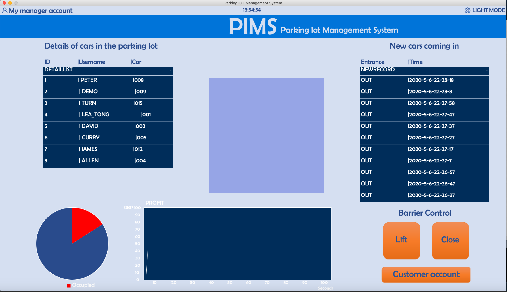
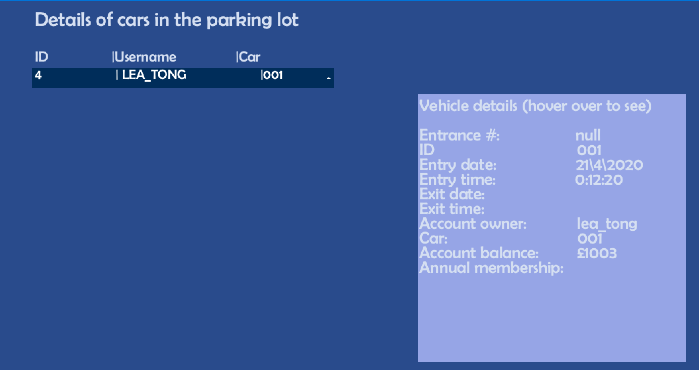
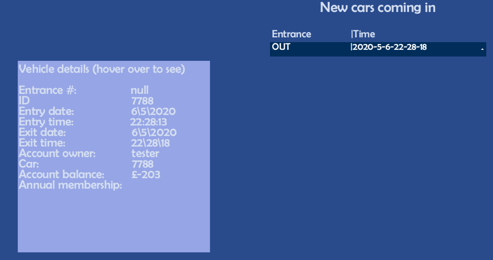
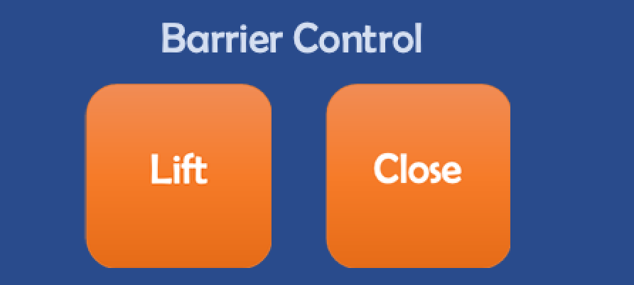
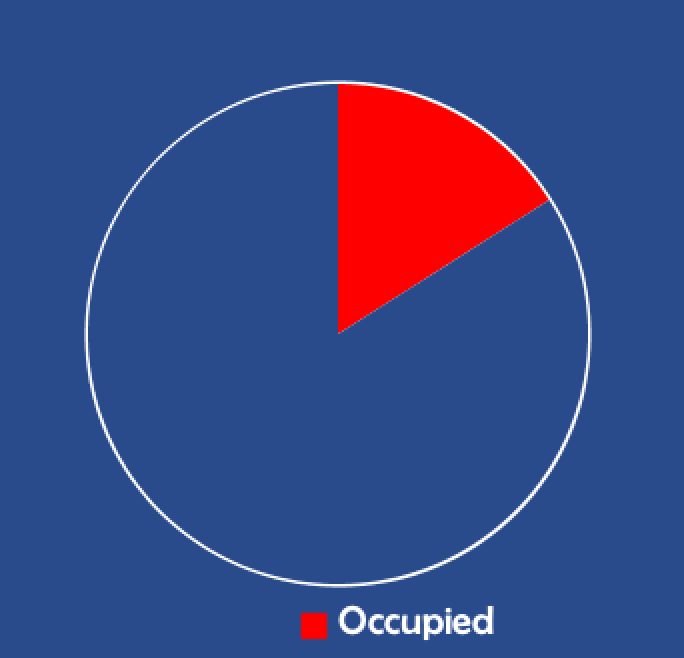
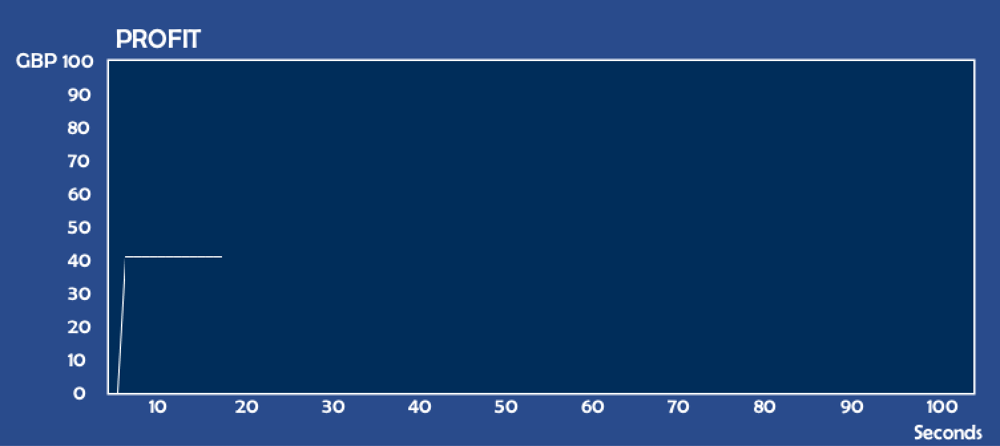

# System Design
# d.The evolution of UI wireframes for key sub-systems
This section provides an introduction to UI design for desktop apps. The principals of this section are Yinan Yang and Shuang Tong. Yinan Yang is responsible for the architecture of the basic UI, the design of the refresh mechanism and the implementation of the data table presentation. The part that Shuang Tong accomplished was the UI interface design and the implementation of data visualization charts. Below is the overall visual of the desktop software.


We go through the features of the desktop program part by part, in the order from top to bottom, left to right.

## Clocks

The top middle position is a text clock that calls the system time. Since this system is a parking management system, there is a strong dependency on time, so a clock in seconds is designed to be displayed at the top of the centre. The refresh mechanism of this clock is to refresh automatically by changing the text content in the DRAW() function of PROCESSING.

```java
int s = second();  // Values from 0 - 59
int m = minute();  // Values from 0 - 59
int h = hour();    // Values from 0 - 23
timer.setText(""+h+":"+m+":"+s);
```

## Colour Mode Switch

A visual button, Setting, is designed on the top right to change the colour mode. The default mode is dark and can be changed to light after adjusting it in the Setting drop-down menu. Below is a visual of the light-coloured mode.



We fixed two color patterns using a total of ten colors in different scenarios.Thanks to Shuang Tong's excellent work, our desktop software visuals look very harmonious.

```java
final int darkModeBackground=color(41, 75, 140);
final int lightModeBackground=color(213, 223, 241);
final int darkModeFontColor=color(213, 223, 241);
final int lightModeFontColor=color(41, 75, 140);
final int darkModeInfoWindowColor=color(132, 160, 215);
final int lightModeInfoWindowColor=color(171, 192, 227);
final int titleBackground=color(87, 106, 195);
final int settingsBackground=color(185, 195, 230);
final int darkModeInfoBackground=color(150,165,230);
final int lightModeInfoBackground=color(185,195,230);
```

The two colour patterns were designed to accommodate the use of the page by administrators in different ambient lighting conditions. This project is a parking software management system, so the desktop program used by the administrator will be running daily, and even in some busy parking lots, there will be a dedicated computer running this program to check the overall status of the parking lot operations. Fixing a colour mode for a long time is not only very damaging to the display screen, most likely to produce colour aberration or colour shift but also has a significant impact on the user's glasses. In a traditional system design, we consider automatically switching between day and night by pulling the local sunrise and sunset times from the Internet and then judging them according to the system time. However, considering the limited time available for this project to be shown, we have only made the menu for switching, which completes the primary function of switching colour modes.

```java
void Settings(int theValue) {
  switch(theValue) {
  case 1: 
    colorModeSwitch=true;
    view.changeColorSettingSwitch();
    view.changeColorButton();
    view.changeColorLabel();
    view.changeColorTimer();
    break;
  case 0:
    colorModeSwitch=false;
    view.changeColorSettingSwitch();
    view.changeColorButton();
    view.changeColorLabel();
    view.changeColorTimer();
    break;
  }
}
```
## Details of cars in the parking lot

The table on the far left shows necessary information about the vehicles that have remained in the parking lot so far. We can see that in the test data, eight cars stayed in this parking lot. If one of the vehicles is selected, the information about the vehicle shown in this entry, including the owner's user name, the time of entry into the parking lot, account balance, and the location of the entrance, will be displayed in the middle exchange box. The specific functions are shown in the figure below.



## New cars coming in

The table on the right represents the entry and exit records for all vehicles. Each record is arranged backwards in time; in other words, the first one shows the most recent entry and exit of a vehicle. The original purpose of this design was to display the barrier's pass log better. Go to the picture below, and the drop-down menu shows the barrier type and time for each bar. Administrators can easily retrieve any time to access vehicle traffic records. Similar to the list of present vehicle information on the left, once we select an entry in the drop-down menu, the details of that entry are displayed in the middle information display window.



We designed the left and right tables and set up a display table in the middle to unify the visual effect. That is, once the user needs to display the data, then the data display area will refresh with new information. The refresh mechanism for the above two tables is to refresh automatically as the desktop software accepts new commands. We set the command to delete the table in the refreshDashboardData() function while rebuilding on refresh. This will call out the JSON array of the controller part about the new data each time, thus completing the data refresh.


```java
void refreshDashboardData() {
  cp5.remove("newRecord");
  cp5.remove("detailList");
  updateDashboardData();
}

```
## Barrier Control

In the bottom right, we implement the part where the application interacts with the barrier on the desktop side.



With the click of two buttons, the desktop software calls the barrierOpen() and barrierClose() methods of the underlying controller to complete remote control of the barrier by transmitting the JSON Object. The specific implementation code is as follows.

```java
public void liftControl(){
    barrierOpen(barrierId); 
}

public void closeControl(){
    barrierClose(barrierId);
}

//Open the barrier
void barrierOpen(int barrierId)
{
  JSONObject json=new JSONObject();
  json.setString("data_type", "m5_receive");
  json.setInt("barrier_id", barrierId);
  json.setString("op_code", "A");
  client.publish(MQTT_topic, json.toString());
}

//Close the barrier
void barrierClose(int barrierId)
{
  JSONObject json=new JSONObject();
  json.setString("data_type", "m5_receive");
  json.setInt("barrier_id", barrierId);
  json.setString("op_code", "B");
  client.publish(MQTT_topic, json.toString());
}
```

## Pie Chart



## Line Chart



## Deficiencies and enhancements

Unfortunately, due to the limitations of the CP5, many features could not be implemented as we originally designed.

In our original design, the present vehicle information and vehicle entry information were presented through a component similar to an excel table. Unfortunately, however, we have reviewed the developer documentation, samples and source code for controlP5 and the package does not have similar components. Due to the controlP5 mechanism, it is also challenging to build a component to refresh the data and call the mouse wheel ourselves. This caused us much regret in the desktop UI design. Of course, the design is now done with drop-down menus, and while it cannot be neatly arranged like an excel table, it still has its advantages. Such as the display highlighting when he is selected, and the timely refreshing mechanism.