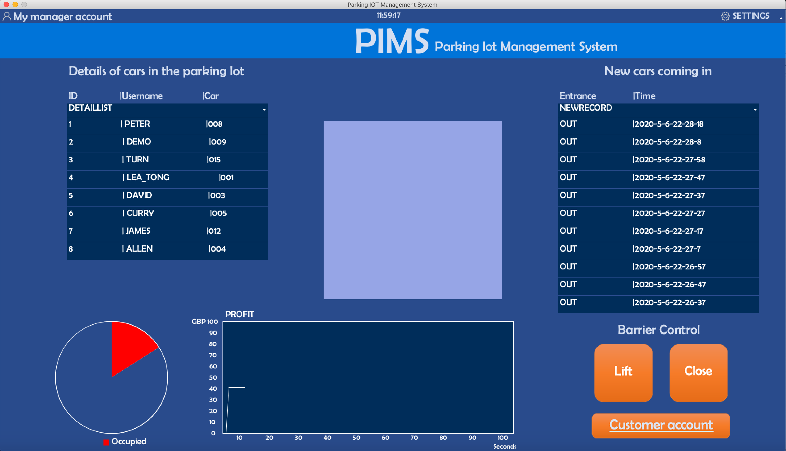

#  The evolution of UI wireframes for key sub-systems
This section provides an introduction to UI design for desktop apps. The principals of this section are Yinan Yang and Shuang Tong. Yinan Yang is responsible for the architecture of the basic UI, the design of the refresh mechanism and the implementation of the data table presentation. The part that Shuang Tong accomplished was the UI interface design and the implementation of data visualization charts.

We go through the features of the desktop program part by part, in the order from top to bottom, left to right.
