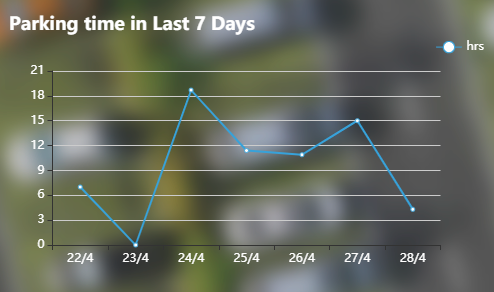

# Web Application

* There are 3 pages of the whole web application: Login, Register, and User Account.
* Main front-end and communication logics are implemented with native JavaScript and JQuery, while some external libraries are used for specific functionalities (e.g. Echarts is used to render user statistic report).
* We use Bootstrap4 as the HTML/CSS framework, therefore Internet Explorer versions under 9 are not supported due to the usage of flex box.
* [Data type](../../data_structure.json) used in the communications between this web application and the controller contains `web_login`, `web_register`, `web_vehicle_register`, `web_vehicle_query`, `web_finance`, `web_recharge` and `web_vehicle_history`.
* All of the data is sent in the format of json. The queries sent by web app have the status code `2`, while the response from the controller has the status code `1` or `0`, represent success or failure respectively.
* The web app recognize whether the arrived data belongs to it according to the status code and username. Messages doesn't belong to itself will be abandoned. As a result, our system allows multi-user situation.
* We also implemented a login state retention system, although it is quite simple.

## [Login Page](#_login)


## [Register Page](#_register)


## [User Account](#_account)


## [Login state retention and domain name filter](#_retention)

<br><br>

<a name="_login"></a>

## Login Page

The data type used in the login communication is [web_login](../../data_structure.json).

Due to the nature of broker and the architecture of the system, we simplified the validation process of user login. The front-end application sends a query contains username and password via MQTT and is fetched by the controller (Desktop Application). 

After validated by the controller, it will send back another message to inform the front-end with a status code `0` or `1`

**Query:**

```json
{
	"data_type": "web_login", 
	"info": {
			"username": "lea_tong",
			"password": "*******",
		    "status": 2
		}
}

```

**Success Response:**

```json
{
	"data_type": "web_login", 
	"info": {
		    "status": 1
		}
}

```

**Failure Response:**

```
{
	"data_type": "web_login", 
	"info": {
		    "status": 0
		}
}
```

**<u>The logic of status code (0 for failure, 1 for success, 2 for query) applies to all the queries and responses in the communication between web app and controller.</u>**

**Note:** users can click "remember me" to store their username and password in the local storage, and will be loaded when they next time login.

<a name="_register"></a>

## Register Page

Similar to login page, this page is for user registering new account. After the page receives a success response, it will be re-directed to the user account page.

**Data Structure:**

```json
{
	"data_type": "web_vehicle_register",  
	"info": {
			"username":"lea_tong",
			"vehicle_id": "acdjcidjd",
			"vehicle_type":"car",
			"status": 2,
			"bluetooth_address" : "47:a9:af:d2:63:cd"
		}
}
```

<a name="_retention"></a>

## Login state retention and domain name filter

In order to maintain the status of login, we implemented a login state retention system using cookies, and thereby use it to block all the illegal access to the `user account` page.

The approach to implement this is much simplified. We did not consider any of the security issues and simply store the username as cookie. Every time when users attempt to access the user account page, the JavaScript logic will validate the login state by checking whether the username in cookie is an empty record. The reason why we don't consider of the security is because of the fact that broker's nature of clear-text protocol, and the users' information can be hacked by anyone who knows our topic name. As a result, we did not implement a session system on the controller. 

However, some cryptography manners such as private/public key pair might solve this issue, but it is too complicated in practice. We might make an extension on this in the future.

<a name="_account"></a>

## User Account Page

The account page is divided into two sections:

* Side bar (Team Info)
* User Info Section

The side bar is a simple static one that has a scrolling animation, while the user info bar is somewhat more complex. 

### Order of Rendering

There will be 2 stages of rendering after the user is redirected to the user account page:

* loading stage
* post-loading stage

#### Loading Stage:

Once the user account page is loaded, it will send 2 queries simultaneously:

**web_vehicle_query**

```
{
	"data_type": "web_vehicle_query", 
	"info": {
		"username": "lea_tong",
		"status": 2
	}
}
```

**web_finance**

```
{

	"data_type": "web_finance", 
	"info": {
			"username":"lea_tong",
			"status": 2
		}
}
```

Their responses are:

**web_vehicle_query:**

```
{
	"data_type": "web_vehicle_query",    
	"info": {
		"username": "lea_tong",
		"vehicle_list": [
			{
				"vehicle_id": "A007",
				"vehicle_type": "car"
			},
			{
				"vehicle_id": "AOO8",
				"vehicle_type": "lorry"
			}
		],
		"status": 1
	}
}
```

**web_finance:**

```
{
	"data_type": "web_finance", 
	"info": {
			"username":"lea_tong",
			"balance": 21331,
			"currency":"GBP",
			"status": 1
		}
}
```

After receiving responses above, the JavaScript logic will re-render the elements that contain `account balance` and `vehicle list` to show the personal information of the certain user.

#### Post-loading Stage

Once the vehicle list has more than 1 element in it, the page will send another query called `web_vehicle_history`, which will make the controller return a response contains the user's parking time in the last 7 days. It looks like this:

```json
{
	"data_type": "web_vehicle_history",
	"info": {
		"username": "lea_tong",
		"vehicle_id": "A007",
		"0": 4.3,	   
		"1": 15,    
		"2": 10.9,
		"3": 11.4,
		"4": 18.7,
		"5": 0,
		"6": 7,
		"status": 1
	}
}
```

Once the page gets this response, it will call the external library [Echarts](https://echarts.apache.org/en/index.html), to render a chart that shows the statistic data of users' parking time in the last 7 days.



### Top Up and Vehicle Register

Users can top up to their accounts by clicking the button `top up now` and register a vehicle by clicking the button `add a vehicle`. These queries will submit the form in the format of json.
