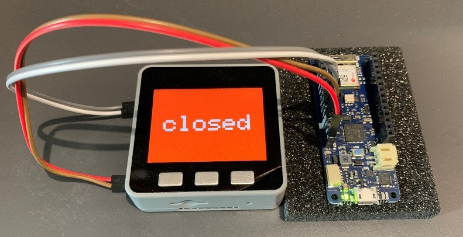
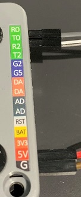

## Please Note: this section contains raw input from group members, not yet merged together.

* [IOT Devices](#_iot) by Tao Xu
* [Desktop Application](#_desktop) by Hongjie Yuan
* [Web Application](#_web) by Fuzhou Wang

<a name="_iot">

# IOT Devices

##  [1. Barriers](#B)
 <br>
An M5Stack and an Arduino MKR WIFI 1010 board constitute the controller of a barrier.
The physical bar of that barrier is simulated by the display on the screen of the M5Stack.

## [2. Authantication Keys](#AK)
 <br>
Each M5StickC is a wireless authentication key.
<br><br><br><br><br><br><br><br><br><br><br><br>

<a name="B"></a>
## Barriers
The function of our barriers can be divided into three parts:

 [1. Sending authentication information to our server.](#B1) <br>
 [2. Receiving commands from our server and operating accordingly.](#B2) <br>
 [3. Handling hardware interrupts from the barriers themselves to control them manually.](#B3) <br>

In implementation, each of the tasks runs on a separate thread, with the following precedence: 3 > 2 > 1.
Manual control should have the highest priority to handle unexpected situations such as server failures.
<br><br>
### Hardware setup
|  |  |
|--|--|

M5Stack's Serial port is connected to WIFI 1010's Serial1 port.
<br><br>
### Some questions you may ask...


*Q. Why did you need an Arduino MKR WIFI 1010 board?* <br>
A. The program storage space on our M5Stack was roughly 1.3 MB, which was less than enough for our program. We needed another device to share its burden.
<br><br>
*Q. Why did you choose the Arduino MKR WIFI 1010 board?* <br>
A. It was easy to migrate a sketch that had been written for M5Stack to the Arduino platform, and vice versa. Any Arduino board with WIFI and Serial ports should do. Or you could use another M5Stack if you wish. But I would argue that an MKR WIFI 1010 board costs less energy and (more importantly) money than an M5Stack.
<br><br>
*Q. My stock of M5Stacks is abundant! How can I run your code on two M5Stacks?* <br>
A.
The [Arduino_HiveMQ_connector.ino](/Arduino_HiveMQ_connector/Arduino_HiveMQ_connector.ino) was written to be compatible with M5Stacks. <br>
Simply compile and upload it to an M5Stack, and do the same things for [M5Stack_bluetooth_detector.ino](/M5Stack_bluetooth_detector/M5Stack_bluetooth_detector.ino) using another M5Stack. <br>
Then, connect the two M5Stacks Serial to Serial. And you should be good to go.

NOTE: Do not forget to change the MQTT_MAX_PACKET_SIZE to something like 1024 or larger for the PubSubClient external library since the default value would be too small.
<br><br>
<a name="B1"></a>
### 1. Sending authentication information to our server.
Once turned on, an M5Stack scans all the Bluetooth devices that are advertising in its vicinity every 5 seconds (can be configured to any value). The Bluetooth address and the Received Signal Strength Indicator (RSSI) are recorded for each device that was present during the latest scan. The Bluetooth addresses, the RSSIs along with other necessary information is packaged into a JSON object with the following format:

    {
    	"data_type": "m5_transmit",
    	"barrier_info": {
    		"barrier_id": 12345
    	},
    	"bluetooth_devices": [
    		{
    			"bluetooth_address": "07:9c:99:32:75:ab",
    			"RSSI": -91
    		},
    		{
    			"bluetooth_address": "15:e4:ac:a9:36:a2",
    			"RSSI": -52
    		},
    		{
    			"bluetooth_address": "4f:fc:d0:83:19:f0",
    			"RSSI": -79
    		},
    	]
    }
Where,

**"data_type"**: what type of data are stored in this JSON object. <br>
	Used for differentiation during data communication with other components of our system.<br>
**"barrier_info"**: stores a child JSON object which contains necessary information about this barrier.<br>
**"barrier_id"**: a unique identification for this barrier.<br>
**"bluetooth_devices"**: stores Bluetooth scan result. Each child object corresponds to a single device. The length of this JSON array is the number of devices that were successfully scanned.<br>
**"bluetooth_address"**: the Bluetooth address of this device.<br>
**"RSSI"**: the RSSI of this device.<br>

This newly created JSON object is then serialized (unprettified) and sent to the Serial port of the M5Stack, which is connected to the Serial1 port of an Arduino MKR WIFI 1010 board.
The WIFI 1010 board reads the serialized JSON from Serial1 port and publish it to MQTT broker.

If the WIFI and the MQTT settings in [Arduino_HiveMQ_connector.ino](/Arduino_HiveMQ_connector/Arduino_HiveMQ_connector.ino) are right, no manual operation is required to perform on the WIFI 1010 board.
The power of the WIFI 1010 board is supplied by its M5Stack partner. After switched on, the WIFI 1010 board keep trying to connect to the configured WIFI AP and MQTT server until success. Then it keeps listening to its Serial port and the MQTT server to handle data transmitting and receiving for the M5Stack connected to it.
<a name="B2"></a>
### 2. Receiving commands from our server and operating accordingly.

When a new message is published in our topic on the MQTT broker, a callback function of the WIFI 1010 board is called, which receives that message and relays it to m5Stack via serial communication.
When the m5Stack senses a JSON string is coming from its Serial port, it tries to deserialize it into a JSON object with the following format:


    {
    	"data_type": "m5_receive",
    	"barrier_id": 12345,
    	"op_code": "B"
    }

Where,

**"data_type"**: what information is stored in this JSON object.<br>
**"barrier_id"**: a unique identification for this barrier.<br>
**"op_code"**: operation code. Indicating what operation to perform, as defined in [Barrier_orders.h](/M5Stack_bluetooth_detector/Barrier_orders.h).

The M5Stack will then execute the operation code if and only if
1.	the deserialization is successful and
2.	the JSON object is in the right format and
3.	the value of "barrier_id" attribute is the same as the id of this barrier.

<a name="B3"></a>
### 3. Handling hardware interrupts from the barriers themselves to control them manually.

The buttons on an M5Stack simulate the buttons for a real barrier. Button interrupts are handled by the M5Stack and translated into operation codes, which will then make the barrier do the corresponding tasks.


<a name="AK"></a>
## Authentication keys.

Each M5StickC issued by us is a BLE key, with the button on it controlling the advertising state (ON/OFF) of its BLE.

If a user approaches one of our barriers with their M5StickC switched on, the Bluetooth address and RSSI will be recorded by that barrier and sent to our server.
Our server will then decide the right operation for that barrier (e.g. open or not).
After the user passes the barrier, they can switch off the M5StickC to save energy. Or they can leave it on if they wish, even if it is still detectable by the barrier. Our server is smart enough to know which device to check next.

Currently, our barriers(M5Stacks) treat our keys (M5StickCs) equally as other Bluetooth devices. The only difference between our keys and other devices are the Bluetooth addresses of our keys are registered on our server. Therefore, our actual keys are Bluetooth addresses.

<a name="_desktop"></a>

# Desktop_app

This part is about communication between desktop app and m5stack. The aim is to
receive message from M5 Stack and send message to M5 Stack. All data is stored
in Json objects using by using different data types.

## Receiving message from M5Stack
The m5_stack will send “m5_transmit” Json object to the desktop_app when there
are cars near the barrier. There may be a lot of Bluetooth signals near the
barrier, such as the owner's mobile phone, headphones, etc., so we have to
choose the highest intensity from the list of Bluetooth signals. However,there
are some tricky situations such as there are many other Bluetooth devices and
many cars near the barrier. Therefore, we should sort the Bluetooth addresses
and select the one with the strongest signal that has been registered. Even if
some Bluetooth signals are very strong, it is invalid if they are not registered
in the website.
```
{
	"data_type": "m5_transmit",
	"barrier_info": {
		"barrier_id": 12345
	},
	"bluetooth_devices": [
		{
			"bluetooth_address": "07:9c:99:32:75:ab",
			"RSSI": -91
		},
		{
			"bluetooth_address": "15:e4:ac:a9:36:a2",
			"RSSI": -52
		},
		{
			"bluetooth_address": "4f:fc:d0:83:19:f0",
			"RSSI": -79
		},
	]
}
```
## Calculate parking charges
After finding the registered car in the database, the controller must first
determine whether the car is already in the garage. If the car is already in the
garage, it means that it is out of the garage this time, otherwise it is
entering the garage. This involves the second date type "parking". This is
mainly used to record the time when the car enters and exits, as well as the car
ID and other information. Whether there is “in” type data for each search, if
it exists, it means that the car is in the garage, and controller should change
“in” to “out” and generate the time of “time_out”. If it does not exist,
create a data with barrier_type “out” and generate the time of “time_in”. When
the car leaves the garage, it looks up the finance status in the database
based on the username, and calculates the current charge based on the difference
between the time the car exits and enters, and updates the finance status.
```
{
"data_type":"parking",   //parking info
"info": {
    "barrier_type": "out",
    "time_in": "2020-3-20-15-4-21",
    "time_out": "2020-3-20-18-4-21",
		"username": "lea",
		"barrier_id": 12345,
		"vehicle_id": "acdjcidjd",
		"vehicle_type":"car"
				}
}
```
```
{
"data_type": "web_finance",  // check the balance
"info": {
    "username":"lea_tong",
    "balance": 21331,
    "currency":"GBP",
    "status": 2
  }
}
```
## Send message to M5Stack
The last part is to send a json object of type "m5_receive" from the desktop app
, which allows the desktop to actively control the switch of a certain barrier
to deal with some special situations.
```
{
"data_type": "web_finance",  // check the balance
"info": {
    "username":"lea_tong",
    "balance": 21331,
    "currency":"GBP",
    "status": 2
  }
}
```

<a name="_web"></a>

# Web Application

* There are 3 pages of the whole web application: Login, Register, and User Account.
* Main front-end and communication logics are implemented with native JavaScript and JQuery, while some external libraries are used for specific functionalities (e.g. Echarts is used to render user statistic report).
* We use Bootstrap4 as the HTML/CSS framework, therefore Internet Explorer versions under 9 are not supported due to the usage of flex box.
* [Data type](../../data_structure.json) used in the communications between this web application and the controller contains `web_login`, `web_register`, `web_vehicle_register`, `web_vehicle_query`, `web_finance`, `web_recharge` and `web_vehicle_history`.
* All of the data is sent in the format of json. The queries sent by web app have the status code `2`, while the response from the controller has the status code `1` or `0`, represent success or failure respectively.
* The web app recognize whether the arrived data belongs to it according to the status code and username. Messages doesn't belong to itself will be abandoned. As a result, our system allows multi-user situation.
* We also implemented a login state retention system, although it is quite simple.

## [Login Page](#_login)


## [Register Page](#_register)


## [User Account](#_account)


## [Login state retention and domain name filter](#_retention)

<br><br>

<a name="_login"></a>

## Login Page

The data type used in the login communication is [web_login](../../data_structure.json).

Due to the nature of broker and the architecture of the system, we simplified the validation process of user login. The front-end application sends a query contains username and password via MQTT and is fetched by the controller (Desktop Application).

After validated by the controller, it will send back another message to inform the front-end with a status code `0` or `1`

**Query:**

```json
{
	"data_type": "web_login",
	"info": {
			"username": "lea_tong",
			"password": "*******",
		    "status": 2
		}
}

```

**Success Response:**

```json
{
	"data_type": "web_login",
	"info": {
		    "status": 1
		}
}

```

**Failure Response:**

```
{
	"data_type": "web_login",
	"info": {
		    "status": 0
		}
}
```

**<u>The logic of status code (0 for failure, 1 for success, 2 for query) applies to all the queries and responses in the communication between web app and controller.</u>**

**Note:** users can click "remember me" to store their username and password in the local storage, and will be loaded when they next time login.

<a name="_register"></a>

## Register Page

Similar to login page, this page is for user registering new account. After the page receives a success response, it will be re-directed to the user account page.

**Data Structure:**

```json
{
	"data_type": "web_vehicle_register",  
	"info": {
			"username":"lea_tong",
			"vehicle_id": "acdjcidjd",
			"vehicle_type":"car",
			"status": 2,
			"bluetooth_address" : "47:a9:af:d2:63:cd"
		}
}
```

<a name="_retention"></a>

## Login state retention and domain name filter

In order to maintain the status of login, we implemented a login state retention system using cookies, and thereby use it to block all the illegal access to the `user account` page.

The approach to implement this is much simplified. We did not consider any of the security issues and simply store the username as cookie. Every time when users attempt to access the user account page, the JavaScript logic will validate the login state by checking whether the username in cookie is an empty record. The reason why we don't consider of the security is because of the fact that broker's nature of clear-text protocol, and the users' information can be hacked by anyone who knows our topic name. As a result, we did not implement a session system on the controller.

However, some cryptography manners such as private/public key pair might solve this issue, but it is too complicated in practice. We might make an extension on this in the future.

<a name="_account"></a>

## User Account Page

The account page is divided into two sections:

* Side bar (Team Info)
* User Info Section

The side bar is a simple static one that has a scrolling animation, while the user info bar is somewhat more complex.

### Order of Rendering

There will be 2 stages of rendering after the user is redirected to the user account page:

* loading stage
* post-loading stage

#### Loading Stage:

Once the user account page is loaded, it will send 2 queries simultaneously:

**web_vehicle_query**

```
{
	"data_type": "web_vehicle_query",
	"info": {
		"username": "lea_tong",
		"status": 2
	}
}
```

**web_finance**

```
{

	"data_type": "web_finance",
	"info": {
			"username":"lea_tong",
			"status": 2
		}
}
```

Their responses are:

**web_vehicle_query:**

```
{
	"data_type": "web_vehicle_query",    
	"info": {
		"username": "lea_tong",
		"vehicle_list": [
			{
				"vehicle_id": "A007",
				"vehicle_type": "car"
			},
			{
				"vehicle_id": "AOO8",
				"vehicle_type": "lorry"
			}
		],
		"status": 1
	}
}
```

**web_finance:**

```
{
	"data_type": "web_finance",
	"info": {
			"username":"lea_tong",
			"balance": 21331,
			"currency":"GBP",
			"status": 1
		}
}
```

After receiving responses above, the JavaScript logic will re-render the elements that contain `account balance` and `vehicle list` to show the personal information of the certain user.

#### Post-loading Stage

Once the vehicle list has more than 1 element in it, the page will send another query called `web_vehicle_history`, which will make the controller return a response contains the user's parking time in the last 7 days. It looks like this:

```json
{
	"data_type": "web_vehicle_history",
	"info": {
		"username": "lea_tong",
		"vehicle_id": "A007",
		"0": 4.3,	   
		"1": 15,    
		"2": 10.9,
		"3": 11.4,
		"4": 18.7,
		"5": 0,
		"6": 7,
		"status": 1
	}
}
```

Once the page gets this response, it will call the external library [Echarts](https://echarts.apache.org/en/index.html), to render a chart that shows the statistic data of users' parking time in the last 7 days.


### Top Up and Vehicle Register

Users can top up to their accounts by clicking the button `top up now` and register a vehicle by clicking the button `add a vehicle`. These queries will submit the form in the format of json.
