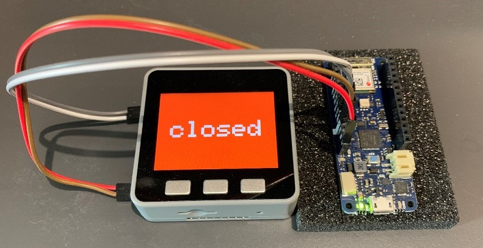
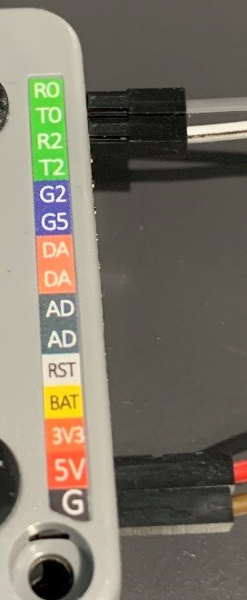
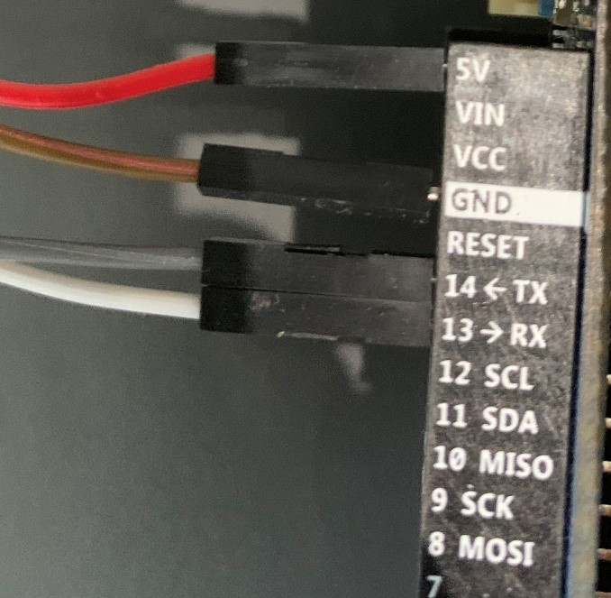

# IOT Devices
##  [1. Barriers](#B)

An M5Stack and an Arduino MKR WIFI 1010 board constitute the controller of a barrier.
The physical bar of that barrier is simulated by the display on the screen of the M5Stack.

## [2. Authantication Keys](#AK)

Each M5StickC is a wireless authentication key.
            

## Barriers
The function of our barriers can be divided into three parts:

 [1. Sending authentication information to our server.](#B1)
 [2. Receiving commands from our server and operating accordingly.](#B2)
 [3. Handling hardware interrupts from the barriers themselves to control them manually.](#B3)
 
In implementation, each of the tasks runs on a separate thread, with the following precedence: 3 > 2 > 1.
Manual control should have the highest priority to handle unexpected situations such as server failures.
  
### Hardware setup
|| | |
|--|--|--|
M5Stack¡¯s Serial port is connected to WIFI 1010¡¯s Serial1 port.
  
### Some questions you may ask...

*Q. Why do you need an Arduino MKR WIFI 1010 board?*

A. The program storage space on our M5Stack is roughly 1.3 MB, which is less than enough for our program. We need another device to share its burden.
 
*Q. Why did you choose the Arduino MKR WIFI 1010 board?*
A. It is easy to migrate a sketch that was written for M5Stack to the Arduino platform, and vice versa. Any Arduino board with WIFI and Serial ports should do. Or you can use another M5Stack if you wish. But I would argue that an MKR WIFI 1010 board costs less energy and (more importantly) money than an M5Stack.
 
*Q. My stock of M5Stacks is abundant. How can I run your code on two M5Stacks?*
A. 
In [Arduino_HiveMQ_connector.ino](/Arduino_HiveMQ_connector/Arduino_HiveMQ_connector.ino):
1. #include <Wifi.h> instead of <WiFiNINA.h>
2. #define Serial1 Serial
Connect the two M5Stacks Serial to Serial. And you should be good to go.

Do not forget to change the MQTT_MAX_PACKET_SIZE for the PubSubClient external library since the default value is too small.
  

### 1. Sending authentication information to our server.
Once turned on, an M5Stack scans all the Bluetooth devices that are advertising in its vicinity every 5 seconds (can be configured to any value). The Bluetooth address and the Received Signal Strength Indicator (RSSI) are recorded for each device that was present during the latest scan. The Bluetooth addresses, the RSSIs along with other necessary information is packaged into a JSON object with the following format:

    {
		"data_type": "m5_transmit",
		"barrier_info": {
			"barrier_id": 12345
		},
		"bluetooth_devices": [
			{
				"bluetooth_address": "07:9c:99:32:75:ab",
				"RSSI": -91
			},
			{
				"bluetooth_address": "15:e4:ac:a9:36:a2",
				"RSSI": -52
			},
			{
				"bluetooth_address": "4f:fc:d0:83:19:f0",
				"RSSI": -79
			},
		]
	}
Where,

**"data_type"**: what type of data are stored in this JSON object. 
	Used for differentiation during data communication with other components of our system.
**"barrier_info"**: stores a child JSON object which contains necessary information about this barrier.
**"barrier_id"**: a unique identification for this barrier.
**"bluetooth_devices"**: stores Bluetooth scan result. Each child object corresponds to a single device. The length of this JSON array is the number of devices that were successfully scanned.
**"bluetooth_address"**: the Bluetooth address of this device.
**"RSSI"**: the RSSI of this device.

This newly created JSON object is then serialized (unprettified) and sent to the Serial port of the M5Stack, which is connected to the Serial1 port of an Arduino MKR WIFI 1010 board.
The WIFI 1010 board reads the serialized JSON from Serial1 port and publish it to MQTT broker.

If the WIFI and the MQTT settings in [Arduino_HiveMQ_connector.ino](/Arduino_HiveMQ_connector/Arduino_HiveMQ_connector.ino) are right, no manual operation is required to perform on the WIFI 1010 board.
The power of the WIFI 1010 board is supplied by its M5Stack partner. After switched on, the WIFI 1010 board keep trying to connect to the configured WIFI AP and MQTT server until success. Then it keeps listening to its Serial port and the MQTT server to handle data transmitting and receiving for the M5Stack connected to it.

### 2. Receiving commands from our server and operating accordingly.

When a new message is published in our topic on the MQTT broker, a callback function of the WIFI 1010 board is called, which receives that message and relays it to m5Stack via serial communication.
When the m5Stack senses a JSON string is coming from its Serial port, it tries to deserialize it into a JSON object with the following format:

    { 
		"data_type": "m5_receive", 
		"barrier_id": 12345, 
		"op_code": "B" 
	}
	
Where,

**"data_type"**: what information is stored in this JSON object.
**"barrier_id"**: a unique identification for this barrier.
**"op_code"**: operation code. Indicating what operation to perform, as defined in [Barrier_orders.h](/M5Stack_bluetooth_detector/Barrier_orders.h).

The M5Stack will then execute the operation code if and only if 
1.	the deserialization is successful and
2.	the JSON object is in the right format and
3.	the value of ¡°barrier_id¡± attribute is the same as the id of this barrier.

### 3. Handling hardware interrupts from the barriers themselves to control them manually.

The buttons on a M5Stack simulate the buttons for a real barrier. Button interrupts are handled by the M5Stack and translated into operation codes, which will then make the barrier do the corresponding tasks.

## Authentication keys.

Each M5StickC issued by us is a BLE key, with the button on it controlling the advertising state (ON/OFF) of its BLE.

If a user approaches one of our barriers with their M5StickC switched on, the Bluetooth address and RSSI will be recorded by that barrier and sent to our server.
Our server will then decide the right operation for that barrier (e.g. open or not).
After the user passes the barrier, they can switch off the M5StickC to save energy. Or they can leave it on if they wish, even if it is still detectable by the barrier. Our server is smart enough to know which device to check next.

Currently, our barriers(M5Stacks) treats our keys (M5StickCs) equally as other Bluetooth devices. The only difference between our keys and other devices are the Bluetooth addresses of our keys are registered on our server. Therefore, our actual keys are Bluetooth addresses.

